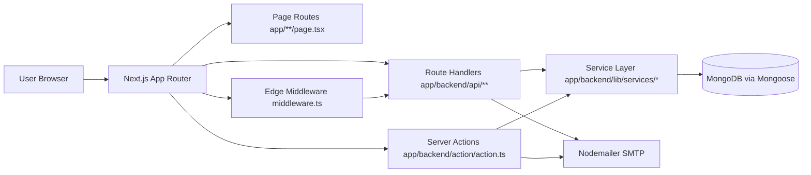
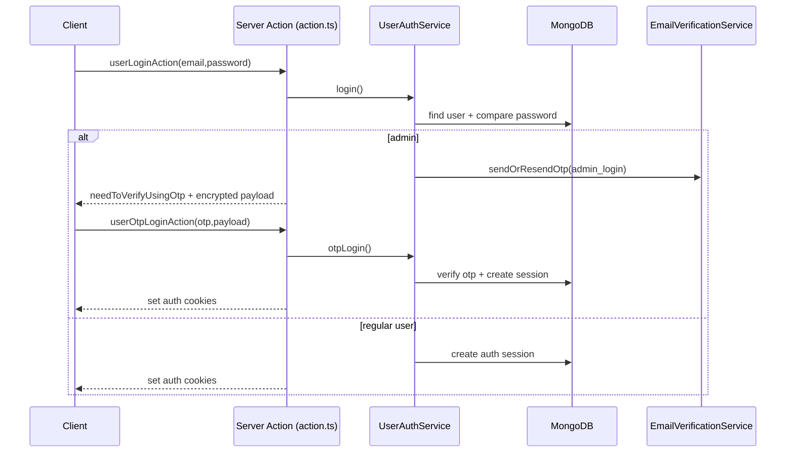

# BES Project - Architecture, Flow, and Folder Structure

## 1) Project Overview

This repository is a **Next.js App Router** application for BES (Broadcast Engineering Society) website and expo workflows.

It combines:
- Public content pages (About BES, Events, Galleries, etc.)
- Registration systems (Visitor, Delegate, Book My Space)
- Authenticated admin/member features
- OTP-based verification flows
- Email notifications
- Visitor analytics counter

Core runtime model:
- Frontend and backend live in one Next.js app (`app/`)
- Server routes are exposed via `app/backend/api/**/route.ts`
- Business logic is split between:
  - `app/backend/lib/services/*` (newer service layer)
  - `app/backend/action/action.ts` (server actions)

---

## 2) Tech Stack

- Framework: Next.js `15.5.9` (App Router)
- UI: React `19.2`, MUI, Tailwind CSS
- Backend runtime: Next.js Route Handlers + Server Actions
- Database: MongoDB via Mongoose
- Auth: JWT + refresh-session model + secure cookies
- OTP/Email: Nodemailer + DB-backed OTP records
- Validation: Zod + react-hook-form
- Build/runtime extras: Vercel Analytics, Vercel Speed Insights, optional bundle analyzer

---

## 3) High-Level Architecture



### Layer responsibilities
- `app/*` route segments: UI pages/layouts and route composition.
- `app/UIComponent/*`: reusable UI widgets (navbar, forms, drawers, etc.).
- `app/frontend/actions/*`: client-side API wrappers.
- `app/backend/api/*`: HTTP endpoints for registrations, auth checks, OTP, visitor tracking, admin toggles.
- `app/backend/lib/services/*`: reusable backend business logic.
- `app/backend/models/*` and `app/backend/lib/db/models/*`: Mongoose models.

---

## 4) Runtime Request Flow

## 4.1 Page render flow

1. Browser requests a route.
2. `middleware.ts` runs first.
3. Middleware handles:
   - Bot/prefetch filtering
   - Protected route token checks (`/user`, `/admin`)
   - Visitor cookie + non-blocking visitor count update
4. Route is rendered by App Router page/layout.
5. Shared global shell from `app/layout.tsx` injects:
   - Navbar
   - Page content
   - Download brochure button
   - Footer
   - Analytics scripts (production)

## 4.2 Auth flow (member/admin)



### Auth details
- Access token: short-lived JWT.
- Refresh token: session token stored in `Session` collection.
- Cookies are split/encrypted in production (`CookiesService`).
- Middleware validates token by calling `POST /backend/api/auth/loginCheck/validateToken`.
- `/admin/**` path additionally checks role is `admin`.

## 4.3 OTP + registration flow (visitor/delegate/my-space)

Common steps:
1. User submits email to `send_otp` endpoint.
2. OTP is saved/updated in DB + email sent.
3. User verifies OTP via `verify_otp` endpoint.
4. Final registration endpoint checks:
   - service active status
   - duplicate email/mobile
   - OTP validity/verification/expiry
5. Registration document saved and admin notification email sent.

Main APIs:
- `POST /backend/api/verification/email_verification/send_otp`
- `POST /backend/api/verification/email_verification/verify_otp`
- `POST /backend/api/registration/visitor_registration`
- `POST /backend/api/registration/delegate_registration`
- `POST /backend/api/registration/book_my_space`

## 4.4 Visitor tracking flow

1. Middleware checks `besSessionCookies`.
2. If absent, sets cookie and sends non-blocking request to `POST /backend/api/track-visitor`.
3. Endpoint validates internal secret header and increments visitor counter.
4. Visitor count can be fetched via `GET /backend/api/track-visitor`.

## 4.5 Admin service toggle flow

1. Admin UI loads all service flags (`AdminServices.getAllRegistrationServices()`).
2. Toggle action encrypts payload on client (`encryptPayload`).
3. API decrypts payload and validates admin auth.
4. Service status (`isActive`) is updated in DB.
5. Home page cache path is revalidated.

---

## 5) App Router Structure (Functional)

Major route groups:
- `/` home page (carousel, event details, partner section, registration status notices)
- `/about_bes/**` about pages, councils, membership, feedback, etc.
- `/event_conference/**` expo and other event content
- `/galleries/pictures` image gallery
- `/registrationform/visitor`
- `/registrationform/delegateregistration`
- `/registrationform/e-badges/download-badge/[[...slug]]`
- `/admin/all-registrations/**` (visitors, delegates, my-space)
- `/admin/services/all-registration-service` (toggle registration service switches)
- `/account_setup/[[...slug]]` signup verification + password setup/reset

---

## 6) Folder Structure (Practical View)

```text
BesProject/
  app/
    layout.tsx                     # global shell, metadata, navbar/footer
    page.tsx                       # homepage
    globals.css
    middleware.ts                  # edge auth + visitor tracking

    UIComponent/                   # reusable frontend components
      Navbar/
      Footer/
      LoginBox/
      UserProfile/
      Carousel/
      common-ui/
      context-provider/

    frontend/
      actions/                     # client-side wrappers for backend APIs
      hooks/

    backend/
      api/                         # route handlers (HTTP endpoints)
        auth/
        registration/
        verification/
        admin/
        track-visitor/
      action/
        action.ts                  # server actions (login/signup/contact/etc.)
      lib/
        db/
          db-config/
          models/                  # newer db models
        services/                  # business services
        revalidation/
        seed-data/
      models/                      # existing/legacy models used by routes
      helper/
      badges/
      config/
      constant.ts

    registrationform/
      Form/
      visitor/
      delegateregistration/
      e-badges/

    admin/
      all-registrations/
      services/

    about_bes/
    event_conference/
    galleries/
    account_setup/

  public/
    Images/
    pdf/
    document/

  scripts/
    InitilizeDB/initilizedb.ts     # seed base DB data
    prebuild-check/validate-env.ts # build-time env validation

  .github/workflows/
    deploy.yml
    pr-deploy.yml

  package.json
  next.config.mjs
  tailwind.config.js
```

---

## 7) Backend API Map

### Auth
- `POST /backend/api/auth/loginCheck/validateToken`
- `POST /backend/api/auth/logout`
- `POST /backend/api/auth/resend-otp`

### OTP / verification
- `POST /backend/api/verification/email_verification/send_otp`
- `POST /backend/api/verification/email_verification/verify_otp`

### Registration
- `POST /backend/api/registration/visitor_registration`
- `POST /backend/api/registration/delegate_registration`
- `POST /backend/api/registration/book_my_space`
- `POST /backend/api/get-price-by-area`

### Admin
- `POST /backend/api/admin/services/activate-deactivate-registration-service`
- `POST /backend/api/admin/revalidate`

### Tracking / badge
- `GET|POST /backend/api/track-visitor`
- `POST /backend/api/verify-and-generate-badge`

---

## 8) Data Model Groups

## 8.1 Registration domain
- `visitor_registration.model.ts`
- `delegate_registration.model.ts`
- `book_my_space.model.ts`
- `space_type_scheme.ts`
- `all_registration_services.model.ts` (feature toggles)

## 8.2 Auth domain
- `user-schema.ts`
- `auth_session.ts`
- `email-verification.ts` (service-aware OTP)
- plus legacy `email_verification.model.ts` still used by multiple APIs

## 8.3 Analytics domain
- `visitor_counter.model.ts`

---

## 9) Configuration and Environment

Critical config files:
- `app/backend/constant.ts`
- `app/backend/config/constant.ts`
- `scripts/prebuild-check/validate-env.ts`
- `app/config/expo.ts`
- `next.config.mjs`

Important environment categories:
- SMTP: sender email/password, SMTP host/port, service
- Database: `MONGODB_URI`, `MONGODB_DB`
- Auth/security: `TOKEN_SECRET_KEY`, `REFRESH_SECRET_KEY`, `GENERAL_SECRET_KEY`, `INTERNAL_SECRET`
- Site URLs + environment mode
- Public service secret for admin toggle payload encryption

Build checks enforce required env keys before `next build`.

---

## 10) Build, Run, and Seed

From `package.json`:
- `yarn dev` -> development server
- `yarn build` -> env check + production build
- `yarn start` -> production runtime
- `yarn seed` -> initializes base DB records (space schemes + service flags)
- `yarn validate-env` -> explicit env validation

---

## 11) Architecture Notes

Current architecture is functional and production-oriented, with strong separation between UI routes and backend service modules. A notable characteristic is coexistence of both newer `lib/db/models` and older `backend/models` patterns; this works today but means model ownership is split across two locations.

