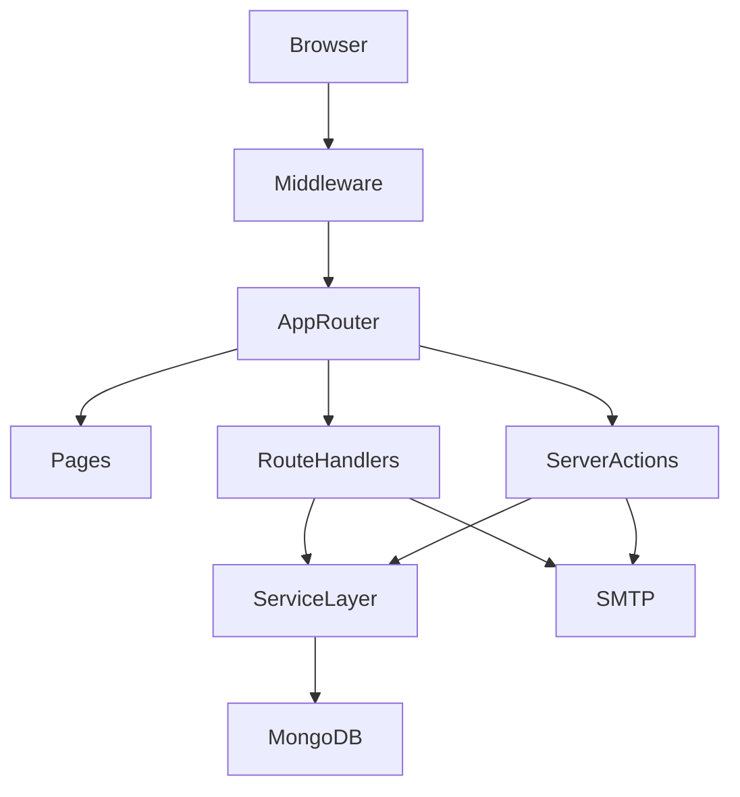

# BES Project - Full Technical Documentation (V2)

## 1. System Summary

BES Project is a monolithic Next.js App Router application that serves:
- Content website pages (About, Expo, Events, Galleries)
- Registration workflows (Visitor, Delegate, Book My Space)
- Member/admin authentication
- OTP verification and email notifications
- Visitor counter analytics

The application keeps UI, API, server actions, service layer, and database models in a single repository under `app/`.

## 2. Technology Stack

| Layer | Technology |
|---|---|
| Framework | Next.js 15.5.9 (App Router) |
| Frontend | React 19.2, MUI, Tailwind CSS |
| Data Validation | Zod, react-hook-form |
| HTTP Client | fetch, axios |
| Backend | Next Route Handlers + Server Actions |
| Database | MongoDB + Mongoose |
| Auth | JWT + refresh-session token model |
| Mail | Nodemailer (SMTP) |
| Observability | @vercel/analytics, @vercel/speed-insights |

## 3. Runtime Architecture



## 4. Request Lifecycle

## 4.1 Middleware (`middleware.ts`)

Middleware responsibilities:
1. Skip prefetch/internal requests.
2. Block common bot/crawler traffic patterns.
3. Skip API/internal guarded requests (`x-edge-visitor-guard`, `/backend/api`).
4. Protect `PROTECTED_PATHS = ['/user', '/admin']` by calling internal token validation endpoint.
5. Check role for admin paths.
6. Set `besSessionCookies` if absent.
7. Fire non-blocking visitor tracking POST with internal secret.

Matcher excludes static files and several internal paths.

## 4.2 Root Layout (`app/layout.tsx`)

Global shell includes:
- `Navbar`
- page body container
- `DownloadBrochureButton`
- `Footer`
- analytics scripts in production

Metadata is globally driven by `app/config/expo.ts`.

## 5. Authentication and Authorization

## 5.1 Auth model

- Access token: short-lived JWT.
- Refresh token: DB session token (`Session` model).
- Cookies: split into header/payload/signature + refresh token via `CookiesService`.
- In production, cookie segments are AES-encrypted.

## 5.2 Login flow

- User submits email/password via server action `userLoginAction`.
- `UserAuthService.login()`:
  - Regular user: creates session immediately.
  - Admin user: sends OTP, requires second step.

Admin OTP step:
- `userOtpLoginAction` validates OTP + payload.
- Creates session and sets cookies.

## 5.3 Route protection

- Middleware protects `/user/**`, `/admin/**`.
- Calls `POST /backend/api/auth/loginCheck/validateToken`.
- Admin routes enforce role check from decoded token.

## 6. Registration Flows

## 6.1 Visitor registration

1. Send OTP: `POST /backend/api/verification/email_verification/send_otp`
2. Verify OTP: `POST /backend/api/verification/email_verification/verify_otp`
3. Submit form: `POST /backend/api/registration/visitor_registration`
4. Backend verifies service flag + OTP + duplicates.
5. Saves visitor record + sends admin email.

## 6.2 Delegate registration

Same OTP pattern, final submit to:
- `POST /backend/api/registration/delegate_registration`

Also enforces service status and duplicate checks.

## 6.3 Book My Space

1. Send/verify OTP.
2. Optional client-side price query (`/backend/api/get-price-by-area`).
3. Submit to `/backend/api/registration/book_my_space`.
4. Backend computes base + tax + total and generates tracking ID.
5. Sends mail to admin and registrant.

## 7. Visitor Tracking Flow

- Middleware sets `besSessionCookies` once.
- Non-blocking POST to `/backend/api/track-visitor` with `x-internal-secret`.
- Counter increment happens in DB.
- `GET /backend/api/track-visitor` returns count.

## 8. Admin Service Toggle Flow

- UI: `app/admin/services/all-registration-service/ui/all-service-ui.tsx`
- Toggle payload is AES-encrypted (`encryptPayload`).
- API decrypts payload and validates admin authorization.
- Updates `AllServices.isActive` and attempts page revalidation.

## 9. Full Route Inventory

## 9.1 Page routes

- `/`
- `/about_bes/Local_Chapter`
- `/about_bes/aim_and_objective`
- `/about_bes/at_glance`
- `/about_bes/background`
- `/about_bes/committees`
- `/about_bes/contact_us`
- `/about_bes/executive_council`
- `/about_bes/faq`
- `/about_bes/feedback`
- `/about_bes/membership`
- `/about_bes/previous_council`
- `/about_bes/previous_council/[id]`
- `/account_setup/[[...slug]]`
- `/admin/all-registrations`
- `/admin/all-registrations/visitors`
- `/admin/all-registrations/delegates`
- `/admin/all-registrations/my-space`
- `/admin/services/all-registration-service`
- `/error_page/invalid_token`
- `/event_conference/bes_expo/conference/call_for_papers`
- `/event_conference/bes_expo/conference/conference_schedule`
- `/event_conference/bes_expo/conference/conference_theme`
- `/event_conference/bes_expo/conference/delegate_fee`
- `/event_conference/bes_expo/conference/list_of_speakers`
- `/event_conference/bes_expo/conference/who_can_attend`
- `/event_conference/bes_expo/exibition/bes_bank_details`
- `/event_conference/bes_expo/exibition/c_&_f_agents`
- `/event_conference/bes_expo/exibition/floor_plan`
- `/event_conference/bes_expo/exibition/guidelines_&_rules`
- `/event_conference/bes_expo/exibition/history`
- `/event_conference/bes_expo/exibition/list_of_exhibitors`
- `/event_conference/bes_expo/exibition/official_hotel`
- `/event_conference/bes_expo/exibition/participation_fee`
- `/event_conference/bes_expo/exibition/products_on_display`
- `/event_conference/bes_expo/exibition/sponsorship_opportunities`
- `/event_conference/bes_expo/exibition/venue`
- `/event_conference/bes_expo/exibition/visa_certificate`
- `/event_conference/bes_expo/exibition/who_can_participate`
- `/event_conference/other_events`
- `/event_conference/other_events/expos`
- `/event_conference/other_events/expos/[id]`
- `/event_conference/other_events/seminars`
- `/event_conference/other_events/seminars/view_details/[id]`
- `/galleries/pictures`
- `/member_signup`
- `/other/userful_links`
- `/registrationform/visitor`
- `/registrationform/delegateregistration`
- `/registrationform/e-badges/download-badge/[[...slug]]`

## 9.2 API routes (`/backend/api/*`)

- `/admin/revalidate`
- `/admin/services/activate-deactivate-registration-service`
- `/auth/loginCheck/validateToken`
- `/auth/logout`
- `/auth/resend-otp`
- `/get-price-by-area`
- `/registration/book_my_space`
- `/registration/delegate_registration`
- `/registration/visitor_registration`
- `/sendMail/test`
- `/track-visitor`
- `/verification/email_verification/send_otp`
- `/verification/email_verification/verify_otp`
- `/verify-and-generate-badge`

## 10. API Contracts

## 10.1 Auth APIs

### `POST /backend/api/auth/loginCheck/validateToken`
- Auth: cookies required.
- Request body: none.
- Success 200:
```json
{ "message": "Valid Credential", "loginStatus": true, "data": { "email": "...", "role": "admin|regular" } }
```
- Failure 401:
```json
{ "message": "Not Valid Credential", "loginStatus": false }
```

### `POST /backend/api/auth/logout`
- Auth: optional cookie.
- Success 200:
```json
{ "message": "Logout Successfully", "loginStatus": false }
```

### `POST /backend/api/auth/resend-otp`
- Request:
```json
{ "payload": "encrypted-admin-login-payload" }
```
- Success 200:
```json
{ "message": "Logout Successfully", "loginStatus": false }
```
- Error: custom error with status code.

## 10.2 OTP APIs

### `POST /backend/api/verification/email_verification/send_otp`
- Request:
```json
{ "email": "user@example.com", "from": "visitor|bookMySpace|..." }
```
- Success 201:
```json
{ "message": "Otp is Send successfully", "status": true }
```

### `POST /backend/api/verification/email_verification/verify_otp`
- Request:
```json
{ "email": "user@example.com", "otp": "1234" }
```
- Success 200:
```json
{ "message": "Email verify SuccessFully", "status": true }
```
- Failure 401:
```json
{ "message": "Verification faild, please enter valid email or otp", "status": false }
```

## 10.3 Registration APIs

### `POST /backend/api/registration/visitor_registration`
- Request fields:
  - `name`, `organisation`, `city`, `mobile`, `email`, `area_of_work`, `otp`
- Success 201:
```json
{ "message": "User is created", "status": true }
```
- Common errors:
  - 401 OTP invalid/expired
  - 409 duplicate email/mobile
  - 500 generic failure

### `POST /backend/api/registration/delegate_registration`
- Request fields:
  - `name`, `organisation`, `department`, `mobile`, `email`, `query`, `session_type`, `payment_type`, `bank_name`, `transaction_no`, `amount`, `other_details`, `otp`, `address`
- Success 201:
```json
{ "message": "User is created", "status": true }
```
- Common errors:
  - 401 OTP invalid/expired
  - 409 duplicate email/mobile
  - 500 generic failure

### `POST /backend/api/registration/book_my_space`
- Request fields:
  - `name`, `about_expo`, `designation`, `company`, `city`, `country`, `mobile`, `email`, `otp`, `space_type`, `gst_number`, `postal_address`, `area_required`
- Success 201:
```json
{ "message": "User registered successfully", "status": true, "tracking_id": "EXPO-YYYYMMDD-XXXXXXXXXXXX" }
```
- Common errors:
  - 401 OTP invalid/expired
  - 409 duplicate email/mobile
  - 400 invalid space type
  - 500 generic failure

### `POST /backend/api/get-price-by-area`
- Request:
```json
{ "selectedSpace": "row-space|shell-space", "totalArea": "number" }
```
- Success 200:
```json
{ "status": true, "basePrice": "₹12345", "calculatedPrice": 12345, "currency": "INR" }
```

## 10.4 Admin APIs

### `POST /backend/api/admin/services/activate-deactivate-registration-service`
- Request:
```json
{ "payload": "encrypted-json" }
```
Decrypted object:
```json
{ "service_name": "my_space|visitor_registration|delegate_registration", "value": true }
```
- Success 200:
```json
{ "message": "Service has been Successfully updated", "status": true }
```

### `POST /backend/api/admin/revalidate`
- Headers: `x-internal-secret`
- Request:
```json
{ "path": "/" }
```
- Success 200:
```json
{ "revalidated": true, "path": "/" }
```

## 10.5 Other APIs

### `GET|POST /backend/api/track-visitor`
- POST requires `x-internal-secret`.
- POST success 201: `{ "success": true }`
- GET success 200: `{ "data": { "count": number } }`

### `POST /backend/api/verify-and-generate-badge`
- Request:
```json
{ "urn": "BES...", "otp": "1234" }
```
- Success: PDF binary response (`application/pdf`).

## 11. Server Actions Contracts (`app/backend/action/action.ts`)

Main server actions used by UI:
- `signUpAction`
- `userLoginAction`
- `userOtpLoginAction`
- `forgotPasswordAction`
- `createNewPasswordAction`
- `contactUsAction`
- `feedbackFormAction`
- `getVisitorDetails`

These actions are used by forms directly (not always through HTTP APIs).

## 12. Data Models and Schema Tables

## 12.1 `AllServices` (`all_registration_services.model.ts`)

| Field | Type | Notes |
|---|---|---|
| `name` | string | display name |
| `service_name` | enum string | unique (`my_space`, `visitor_registration`, `delegate_registration`) |
| `description` | string | optional |
| `isActive` | boolean | feature toggle |
| `createdAt/updatedAt` | Date | timestamps |

## 12.2 `Session` (`auth_session.ts`)

| Field | Type | Notes |
|---|---|---|
| `userId` | ObjectId ref User | required |
| `token` | string | refresh/session token, unique |
| `loginMethod` | enum | password/google/github/magic_link |
| `expiresAt` | Date | required |
| `status` | enum | active/expired/revoked/signout/etc |
| device/network metadata | mixed | optional |

## 12.3 `User` (`user-schema.ts`)

| Field | Type | Notes |
|---|---|---|
| `first_name` | string | required |
| `last_name` | string | required |
| `email` | string | unique |
| `passwordHash` | string | optional |
| `role` | enum | admin/regular |
| `status` | enum | lifecycle state |
| `verificationToken` | string | signup/forgot flow |
| `verificationTokenExpires` | Date | token expiry |

## 12.4 `emailVerificationLatest` (`email-verification.ts`)

| Field | Type | Notes |
|---|---|---|
| `email` | string | part of compound unique index |
| `service` | string | part of compound unique index |
| `otpCode` | string | OTP |
| `isVerified` | boolean | OTP verified flag |
| `hasOtpExpired` | boolean | expiry flag |
| `timeStamp` | number | generation timestamp |
| `expiresAt` | Date TTL | TTL index |

## 12.5 `emailVerification` legacy (`email_verification.model.ts`)

| Field | Type | Notes |
|---|---|---|
| `email` | string | unique |
| `otpCode` | number | OTP |
| `timeStamp` | number | timestamp |
| `isVerified` | boolean | verified flag |
| `hasOtpExpired` | boolean | expired flag |

## 12.6 `visitorRegistrationUser`

| Field | Type | Notes |
|---|---|---|
| `name` | string | required |
| `organisation` | string | required |
| `city` | string | required |
| `mobile` | string | unique |
| `email` | string | unique |
| `area_of_work` | string | required |
| `tracking_id` | number | auto-generated pre-validate |
| `unique_reference_number` | string | unique URN |

## 12.7 `delegateUser`

| Field | Type | Notes |
|---|---|---|
| `name` | string | required |
| `organisation` | string | required |
| `department` | string | required |
| `postal_address` | string | required |
| `mobile` | string | unique |
| `email` | string | unique |
| `session_type` | string | fee selection |
| `payment_type` | string | payment mode |
| `transaction_no` | number | required |
| `amount` | number | required |
| `tracking_id` | number | auto-generated pre-validate |

## 12.8 `BookMySpace`

| Field | Type | Notes |
|---|---|---|
| `name` | string | required |
| `organisation` | string | required |
| `email` | string | unique |
| `mobile` | string | unique |
| `city/country/postal_address` | string | required |
| `tracking_id` | string | unique |
| `space_scheme` | ObjectId ref SpaceTypeScheme | required |
| `selected_space_scheme` | object | denormalized snapshot |
| `space_sqm` | number | required |
| `total_space_price` | number | base |
| `total_gst_amount` | number | GST |
| `total_price_with_gst` | number | final |

## 12.9 `SpaceTypeScheme`

| Field | Type | Notes |
|---|---|---|
| `type` | enum | row-space/shell-space |
| `name` | enum | display label |
| `price_per_sqm` | number | pricing |
| `tax_rate` | number | default 18 |
| `minimum_space_rquired` | number | min area |
| `is_active` | boolean | active scheme |

## 12.10 `visitorCounter`

| Field | Type | Notes |
|---|---|---|
| `numberOfVisitor` | number | global counter |

## 13. Frontend Module Breakdown

## 13.1 Shared UI
- `app/UIComponent/Navbar/*` - top navigation and menu rendering.
- `app/UIComponent/Footer/*` - footer and visitor count.
- `app/UIComponent/LoginBox/*` - login + OTP modal flow.
- `app/UIComponent/UserProfile/*` - profile and drawers for user/admin.
- `app/UIComponent/common-ui/*` - alerts, side nav, unavailable-message.

## 13.2 API client wrappers
- `app/frontend/actions/index.ts` - generic `fetchApiHub` and response handling.
- `app/frontend/actions/login/*` - login check, logout, resend OTP.
- `app/frontend/actions/admin-api/*` - admin toggle API wrapper.
- `app/frontend/actions/common-api/*` - visitor count API wrapper.

## 13.3 Registration components
- Generic registration renderer: `app/registrationform/Form/Form.tsx`.
- Visitor and delegate forms are JSON-driven from `db.json` files.
- Book My Space uses dedicated typed React Hook Form implementation.

## 14. Folder Structure and Responsibilities

```text
app/
  about_bes/                  About content pages + left side nav
  event_conference/           Expo + other events pages + side navs
  registrationform/           Visitor/delegate/e-badge registration UX
  admin/                      Admin dashboards and controls
  backend/
    api/                      HTTP endpoints
    action/                   Server actions used by client forms
    lib/services/             Business logic services
    lib/db/                   DB connection and newer schemas
    models/                   Existing schemas used by current APIs
  frontend/                   Client action wrappers and hooks
  UIComponent/                Reusable UI components
  config/                     SEO/expo configs
  scripts/                    New Relic snippets
```

Non-app directories:
- `public/` static assets (images, pdfs, docs)
- `scripts/` build checks and DB initialization scripts
- `.github/workflows/` CI automation workflows

## 15. Environment Variables

Validated by `scripts/prebuild-check/validate-env.ts`:
- `SENDER_EMAIL`
- `SENDER_EMAIL_PASSWORD`
- `SMTP_HOST`
- `EMAIL_SERVICE`
- `SMTP_PORT`
- `ADMIN_RECEIVER_MAIL`
- `enviroment`
- `production_url`
- `local_url`
- `TOKEN_SECRET_KEY`
- `SECRET_KEY`
- `MONGODB_URI`
- `MONGODB_DB`
- `PREFIX_REFERENCE_NUMBER`
- `REFRESH_SECRET_KEY`
- `GENERAL_SECRET_KEY`
- `INTERNAL_SECRET`
- `NEXT_PUBLIC_SERVICE_SECRET`

## 16. Build, Deployment, and Scripts

`package.json` scripts:
- `dev` - run local dev server
- `build` - validate env then build
- `start` - production run
- `seed` - initialize DB service + pricing seeds
- `analyze` - run bundle analyzer

GitHub workflows:
- `deploy.yml` and `pr-deploy.yml` create owner-account commits for deploy-related flow.

## 17. Caching and Revalidation

- Several pages use route-level `revalidate` (e.g., 1 hour / 4 hours).
- Admin service toggle API triggers path revalidation.
- `next.config.mjs` defines static caching headers for image/document routes.

## 18. Security Summary

Implemented:
- Cookie-based auth with httpOnly/secure/sameSite
- Role checks for admin routes
- Internal secret guard for visitor tracking/revalidation calls
- OTP verification for registration flows
- Encrypted payload for admin service toggle

Current limitations noted in code are listed in next section.

## 19. Known Issues and Risks (From Current Code)

1. Delegate page checks wrong service flag.
- File: `app/registrationform/delegateregistration/page.tsx`
- It checks `VISITOR_REGISTRATIONS` instead of `DELEGATE_REGISTRATIONS`.

2. Minimum area validation condition bug in pricing endpoints.
- Files:
  - `app/backend/api/get-price-by-area/route.ts`
  - `app/backend/api/registration/book_my_space/route.ts`
- Condition uses `if (!scheme.minimum_space_rquired && scheme.minimum_space_rquired > space_sqm)` which can never correctly enforce minimum in typical cases.

3. `verify_otp` route catch block can return undefined response.
- File: `app/backend/api/verification/email_verification/verify_otp/route.ts`
- Empty catch block.

4. OTP update helper does not update DB.
- File: `app/backend/action/updateDb.ts`
- `updateEmailOtpWithCustomAttribute` uses `find` instead of `update`.

5. Mixed OTP model usage (legacy + newer model) may cause behavioral divergence.
- Files in both:
  - `app/backend/models/email_verification.model.ts`
  - `app/backend/lib/db/models/email-verification.ts`

6. Protected routes mismatch between client and middleware.
- File: `app/UIComponent/protected-pages/index.ts` has `"/users/*"` while middleware protects `/user`.

7. `CookiesService.setSecureCookies` and delete methods use `forEach(async ...)` without awaiting.
- File: `app/backend/lib/services/cookies-service/index.tsx`
- Potential timing race.

8. `sendMail/test` route signature is not a normal Next route handler input.
- File: `app/backend/api/sendMail/test/route.ts`
- Function signature currently receives `{ email, subject, ... }` in GET args.

9. Build environment validator has duplicate `NEXT_PUBLIC_SERVICE_SECRET` entry and includes `SECRET_KEY` that is not referenced in config module.
- File: `scripts/prebuild-check/validate-env.ts`

## 20. Recommended Next Improvements

1. Consolidate to one OTP model and one model namespace pattern.
2. Fix min-area checks in pricing/book-my-space APIs.
3. Fix delegate page service flag check.
4. Normalize protected route constants between middleware and UI provider.
5. Add integration tests for:
   - auth refresh
   - OTP lifecycle
   - registration duplicate checks
   - admin service toggles
6. Add API request/response schemas (zod) at route boundary for stricter runtime validation.
7. Add centralized logger and remove noisy console logs in production paths.

## 21. Primary Documentation Files

- `PROJECT_ARCHITECTURE_AND_FLOW.md` (architecture summary)
- `TECHNICAL_DOCUMENTATION_V2.md` (this full technical document)

